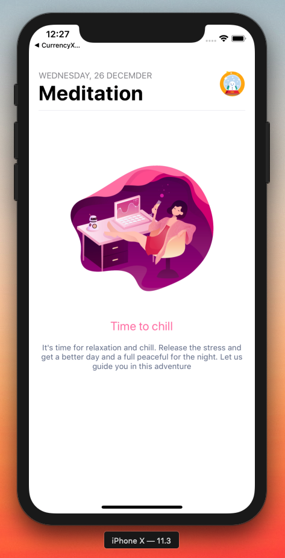
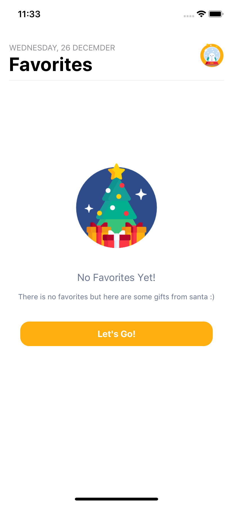
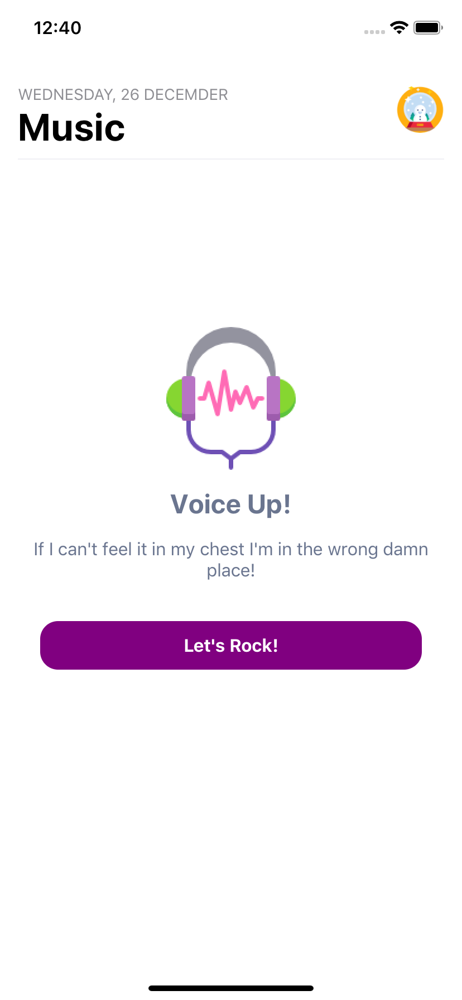
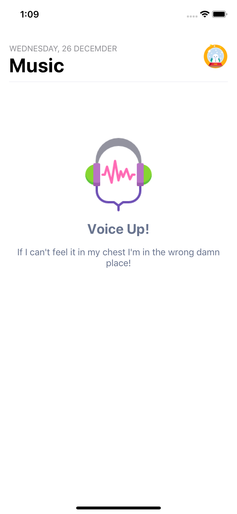
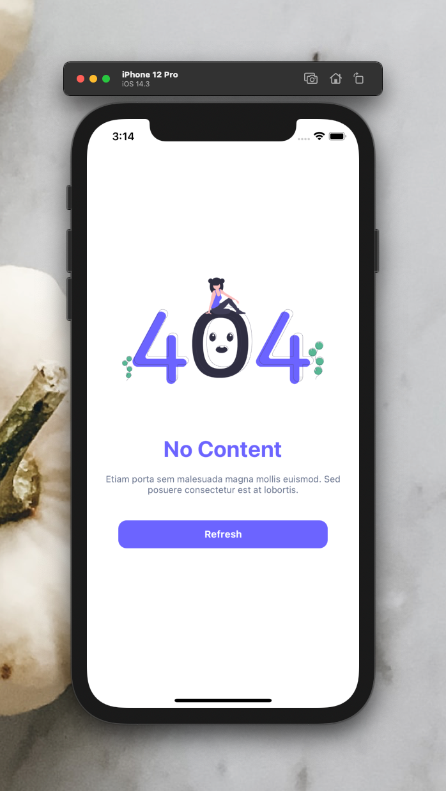

# 

[](https://github.com/WrathChaos/react-native-button)

[](https://github.com/WrathChaos/react-native-easy-state-view)

[](https://www.npmjs.com/package/react-native-easy-state-view)
[](https://www.npmjs.com/package/react-native-easy-state-view)

[](https://opensource.org/licenses/MIT)

<p align="center">


</p>

<p align="center">


</p>

<p align="center">

</p>

## Version 1.0.0 🥳

Version 1.0.0 is finally here after thousands of downloads and usage of this library 😎
I wonder that what you're going to build with this library. I will share your awesome product on here

## Installation

Add the dependency:

```ruby
npm i react-native-easy-state-view
```

## Peer Dependencies

##### IMPORTANT! You need install them

```js
"@freakycoder/react-native-bounceable": ">= 0.2.4"
```

## Basic Usage

```jsx
<StateView
  enableButton
  buttonText="Refresh"
  title="No Content"
  description="Etiam porta sem malesuada magna mollis euismod. Sed posuere consectetur est at lobortis."
  onPress={() => {}}
/>
```

### Example Application

- I shared the example project to check what it is:
  [check the code](examples/App.js), and yes! :) all of the images, screenshots are directly taken
  from this example. Of course, you can simply clone the project and run the example on your own environment.

### Configuration - Props

| Property             | Type      | Default                | Description                                                 |
| -------------------- | --------- | ---------------------- | ----------------------------------------------------------- |
| style                | style     | default                | customize/override the default style of the main state view |
| title                | string    | undefined              | change the title                                            |
| titleStyle           | style     | default                | use this to change title's style                            |
| onPress              | function  | undefined              | use this to handle the press the button                     |
| description          | string    | undefined              | use this to change description's style                      |
| descriptionStyle     | style     | default                | use this to change description's style                      |
| isCenter             | boolean   | false                  | use this to center the StateView's content                  |
| imageStyle           | style     | default                | use this to change own image style                          |
| imageSource          | image     | Cutie Snow Globe Image | use this to set own image source                            |
| enableButton         | boolean   | false                  | set the enableButton to use the button                      |
| buttonComponent      | component | RNBounceable           | use this to implement own button                            |
| buttonContainerStyle | style     | default                | use this to implement own style for button container        |
| buttonTextStyle      | style     | default                | use this to implement own style for button's text style     |
| buttonText           | string    | "Let's Go!"            | use this to set button's text                               |
| shadowStyle          | style     | \_shadowStyle          | use this to set own shadow style                            |

## Credits

Thanks for Kaylylai for these awesome illustrations :O I love her work a lot!
Here is the Kaylylai's Dribbble portfolio : [Kaylylai's Dribble](https://dribbble.com/kaylylai)

## Author

FreakyCoder, kurayogun@gmail.com

## License

React Native Easy State View Library is available under the MIT license. See the LICENSE file for more info.
